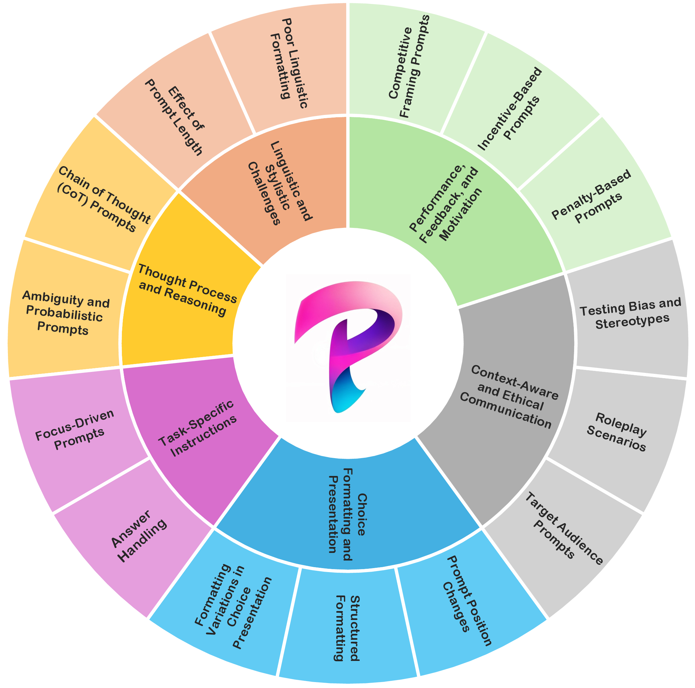

#  Promptception: How Sensitive Are Large Multimodal Models to Prompts? [EMNLP 2025 🔥]

<p align="center">
    
</p>

> #### [Mohamed Insaf Ismithdeen](https://scholar.google.com/citations?user=--fYSbUAAAAJ&hl=en), [Muhammad Uzair Khattak](https://scholar.google.com/citations?user=M6fFL4gAAAAJ&hl=en), [Salman Khan](https://salman-h-khan.github.io/)

#### Mohamed bin Zayed University of Artificial Intelligence (MBZUAI), Swiss Federal Institute of Technology Lausanne (EPFL), Australian National University

[](https://www.arxiv.org/abs/2509.03986)
[](https://insafim.github.io/Promptception/)
[](https://mbzuaiac-my.sharepoint.com/:f:/g/personal/mohamed_ismithdeen_mbzuai_ac_ae/EhGMCrVvuDpMlFftWqRvs1UBU-Sb1wSv_fhYd9IIK8hUCg?e=rtJyQI)

Official GitHub repository for  `Promptception: How Sensitive Are Large Multimodal Models to Prompts?`.

## 📢 Latest Updates

- **Aug-2025:** Promptception is accepted at EMNLP 2025 (Findings)! 🎊🎊  
- **Nov-2025:** Mohamed Insaf Ismithdeen will be presenting *Promptception* as a **poster** at EMNLP 2025 (Findings Session 3, Nov 7). 📝✨ 
---

##   Overview

<p align="center">
  
</p>

Despite the success of Large Multimodal Models (LMMs) in recent years, prompt design for  LMMs in Multiple‑Choice Question Answering (MCQA) remains poorly understood. We show that even minor variations in prompt phrasing and structure can lead to accuracy deviations of up to 15\% for certain prompts and models. This variability poses a challenge for transparent and fair LMM evaluation, as models often report their best-case performance using carefully selected prompts. To address this, we introduce **Promptception**, a systematic framework for evaluating prompt sensitivity in LMMs. It consists of 61 prompt types, spanning 15 categories and 6 supercategories, each targeting specific aspects of prompt formulation, and is used to evaluate 10 LMMs ranging from lightweight open‑source models to GPT-4o and Gemini 1.5 Pro, across 3 MCQA benchmarks: MMStar, MMMU‑Pro, MVBench. Our findings reveal that proprietary models exhibit greater sensitivity to prompt phrasing, reflecting tighter alignment with instruction semantics, while open‑source models are steadier but struggle with nuanced and complex phrasing. Based on this analysis, we propose Prompting Principles tailored to proprietary and open-source LMMs, enabling more robust and fair model evaluation.

---
## 🏆 Highlights
1. **Comprehensive Prompt Sensitivity Analysis:** We present the most extensive study to date on the impact of prompt variations across diverse multimodal benchmarks and LMM architectures. To facilitate this study, we introduce Promptception, a systematic evaluation framework comprising of 61 prompt types, organized into 15 categories and 6 supercategories, each designed to probe specific aspects of prompt formulation in LMMs.
2. **Evaluation Across Models, Modalities, and Benchmarks:** We assess prompt sensitivity across a diverse set of model sizes and architectures, including both open-source and proprietary LMMs. Our analysis spans multiple modalities and benchmarks; MMStar (single image), MMMU-Pro (multi-image), and MVBench (video) and we further evaluate sensitivity across various question dimensions within these benchmarks to ensure a comprehensive understanding.
3. **Best Practices for Prompting:** We identify key trends in prompting and propose Prompting Principles for effective and consistent evaluation of LMMs.

## Getting started with Promptception

### Downloading and Setting Up the Datasets

Download the datasets (**MMMU-Pro**, **MMStar**, and **MVBench**) [using this link (zipped)](https://mbzuaiac-my.sharepoint.com/:f:/g/personal/mohamed_ismithdeen_mbzuai_ac_ae/EhGMCrVvuDpMlFftWqRvs1UBU-Sb1wSv_fhYd9IIK8hUCg?e=BiY86a).

After downloading and unzipping, arrange them as follows:

```
Datasets/
|–– MMMU-Pro/
|   |–– Images-standard/
|   |–– Images-vision/
|   |–– MMMU-Pro_standard_4options.json
|   |–– MMMU-Pro_standard_10options.json
|   |–– MMMU-Pro_Vision_no-options.json
|
|–– MMStar/
|   |–– MMStar.json
|
|–– MVBench/
|   |–– mvbench_videos/
|   |–– mvbench.json
|   |–– mvbench_100.json
```
### Prompts

### Prompts
All prompt templates are provided in the `Prompts/` directory as `.yaml` files.  
Select the appropriate file depending on the **modality** (image/video) and the **model type** (open-source vs closed-source such as GPT-4o, Gemini-1.5 Pro).

---

## :hammer_and_wrench: Setup and Usage
To replicate our experiments and run inference with Hugging Face Transformers on NVIDIA GPUs, follow the steps below.  
Our setup was tested on **Python 3.10** with CUDA-enabled PyTorch.

1. Clone the repository:
```bash
git clone https://github.com/insafim/Promptception.git
```
2. Change directory:
```bash
cd Promptception
```
3. Environment setup
   We used Python 3.10 with CUDA-enabled PyTorch for GPU inference.

   a) Create and activate a new environment:

    ```bash
    conda create --name promptception python=3.10
    conda activate promptception
    ```
    b) Install all required dependencies (for both open-source Hugging Face models and closed-source APIs):

    ```bash
    pip install pillow==10.1.0 \
                torch==2.1.2 \
                torchvision==0.16.2 \
                transformers==4.40.0 \
                sentencepiece==0.1.99 \
                decord \
                openai \
                opencv-python \
                google-generativeai
    ```

## Citation 📜
If you are using Promptception in your research or applications, please cite using this BibTeX:
```bibtex
@misc{ismithdeen2025promptceptionsensitivelargemultimodal,
      title={Promptception: How Sensitive Are Large Multimodal Models to Prompts?}, 
      author={Mohamed Insaf Ismithdeen and Muhammad Uzair Khattak and Salman Khan},
      year={2025},
      eprint={2509.03986},
      archivePrefix={arXiv},
      primaryClass={cs.CV},
      url={https://arxiv.org/abs/2509.03986}, 
}
```

## License :scroll:
<a rel="license" href="http://creativecommons.org/licenses/by-nc-sa/4.0/"></a><br />This work is licensed under a <a rel="license" href="http://creativecommons.org/licenses/by-nc-sa/4.0/">Creative Commons Attribution-NonCommercial-ShareAlike 4.0 International License</a>.


Looking forward to your feedback, contributions, and stars! :star2:
Please raise any issues or questions [here](https://github.com/insafim/Promptception/issues). 
